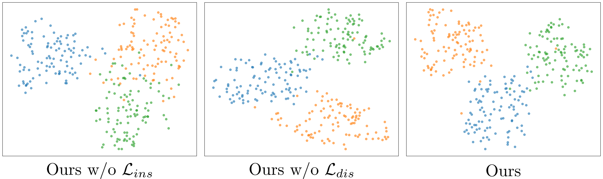

# Additional answers for reviewer RNQH

## Proof of the two problems mentioned in the introduction

We utilized the labels provided in the [FFHQ features dataset](https://github.com/DCGM/ffhq-features-dataset) as our reference. Specifically, we selected three mutually exclusive classes—non-smiling, non-glasses-wearing females; smiling, non-glasses-wearing males; and non-smiling, glasses-wearing males. After performing PCA-based dimensionality reduction, we visualized their features. We conducted experiments under conditions with local-scale self-adaptive rotation, both with and without global-scale matching. The results are illustrated in the figure below.

From the visualization results, we can see that when the rotation strategy is not applied, the relationship between domains collapses, and when OT is not applied, the shape of the domain changes.