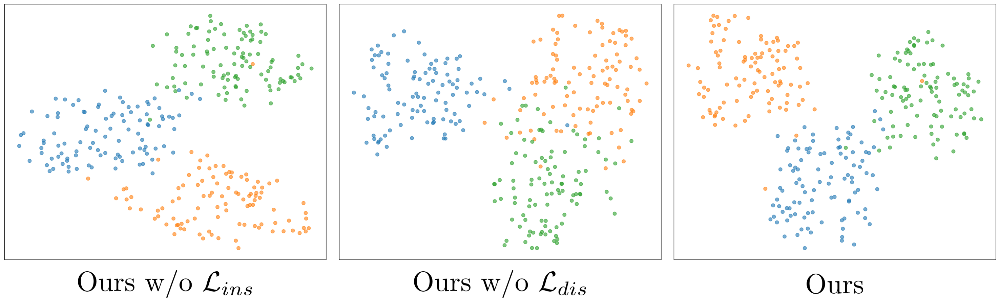

# Response to Review RNQH

We apologize for taking up your time. Due to limitations on response length and format, we have provided an additional link to further address your question. We sincerely appreciate your patience in reviewing it.

## Visualized Analysis of the actual feature distribution

We utilized the labels provided in the [FFHQ features dataset](https://github.com/DCGM/ffhq-features-dataset) as our reference. We visualize the feature distribution of our method on FFHQ dataset by t-SNE. Here, we utilize the labels provided in the FFHQ features dataset as our reference. Specifically, we selected three mutually exclusive classes—non-smiling, non-glasses-wearing females; smiling, non-glasses-wearing males; and non-smiling, glasses-wearing males. We compare the feature distribution of our method w/ and w/o our proposed two specific losses. 

From the visualization results, we can see that when the local-scale self-adaptive rotation ($L_{ins}$) is not applied, the shape of the class changes. This indicates that without the local-scale constraint, the features within the class become more dispersed. When global-scale optimal distribution matching ($L_{dis}$) is not applied, the relationship between classes collapses. This indicates that without the global-scale constraint, the relationships between classes are affected. It significantly demonstrates that our proposed losses can achieve the goal we have claimed.